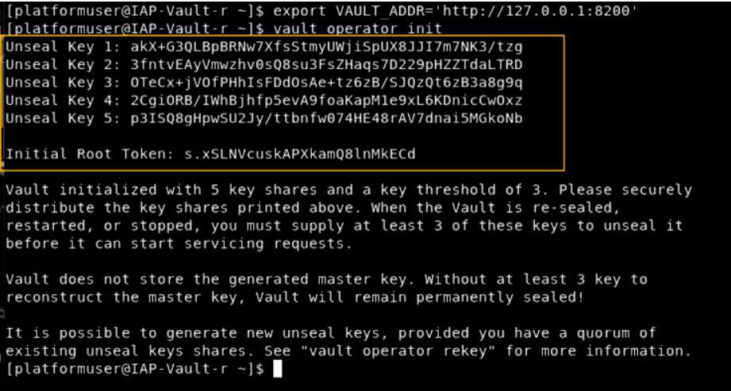

Nouveau Middleware: A Platform for extending your capabilities
============
The Nouveau Middleware is a mature platform with open APIs that provides a reliable, robust, and affordable extension to the core banking solution for financial institutions offering services to their customers.

### A typical top-level directory layout

    .
    ├── nouveau-middleware
    │   ├── account-service
    │   │   ├── src
    │   │   ├── Dockerfile
    │   │   └── pom.xml
    │   ├── api-gateway
    │   │   ├── src
    │   │   ├── Dockerfile
    │   │   └── pom.xml
    │   ├── branch-service
    │   │   ├── src
    │   │   ├── Dockerfile
    │   │   └── pom.xml
    │   ├── customer-service
    │   │   ├── src
    │   │   ├── Dockerfile
    │   │   └── pom.xml
    │   ├── discovery-server
    │   │   ├── src
    │   │   ├── Dockerfile
    │   │   └── pom.xml
    │   ├── notification-service
    │   │   ├── src
    │   │   ├── Dockerfile
    │   │   └── pom.xml
    │   ├── teller-service
    │   │   ├── src
    │   │   ├── Dockerfile
    │   │   └── pom.xml
    │   ├── transaction-service
    │   │   ├── src
    │   │   ├── Dockerfile
    │   │   └── pom.xml
    │   ├── vault-service
    │   │   ├── Dockerfile
    │   │   └── run.sh
    │   ├── grafana
    │   │   └── prometheus.yml
    │   ├── docker-compose.yml
    │   └── pom.xml
    └── ...

Requirements
============
* Java >= 17 (OpenJDK JVM)
* Postgres

__RECOMMENDATION__: you need to use an instance of postgres which ran on a server instead of a container to avoid any issue with data lost.

Instructions to install Vault server
============
- Let's start by installing `yum-config-manager` :
```
sudo yum install -y yum-utils
```
- Let's use yum-config-manager to add the official package of HashiCorp :
```
sudo yum-config-manager --add-repo https://rpm.releases.hashicorp.com/RHEL/hashicorp.repo
```
- Install Vault
```
sudo yum -y install vault
```
- Check if vault was properly install with the following command :
```
vault
```
- Let's open the ports used by vault
```
sudo firewall-cmd --add-port=8200/tcp --permanent
```
```
sudo firewall-cmd -reload
```
- Create config file `/etc/vault/config.hcl` to run in production mode :
```
storage "raft" {
  path    = "/opt/vault/data"
  node_id = "node1"
}

listener "tcp" {
  address     = "127.0.0.1:8200"
  tls_disable = "true"
}

api_addr = "http://127.0.0.1:8200"
cluster_addr = "https://127.0.0.1:8201"
ui = true
```
- Launch vault service in background mode :
```
vault server -config=/etc/vault/config.hcl & exit
```
- Unseal vault server
```
export VAULT_ADDR='http://127.0.0.1:8200'
vault operator init
```

- Enable KV secrets engine
```
export VAULT_ADDR='http://127.0.0.1:8200'
vault secrets enable kv
```
- Set services variables
```
export VAULT_ADDR="http://xxx.xxx.xxx.xxx:xxxx"
vault login <INITIAL_ROOT_TOKEN>
```
```
vault kv put secret/transaction-service cbs.database.url=jdbc:informix-sqli://xxx.xxx.xxx.xxx:xxxx/amplintel:informixserver=ol_intel cbs.database.username=xxxxxx cbs.database.password=xxxxxx cbs.database.driver=com.informix.jdbc.IfxDriver spring.datasource.url=jdbc:postgresql://xxx.xxx.xxx.xxx:xxxx/middleware spring.datasource.username=postgres spring.datasource.password=postgres spring.jpa.properties.hibernate.dialect=org.hibernate.dialect.PostgreSQLDialect accounting.booklet.product=110,170 accounting.booklet.posting=true accounting.deposit.codes=001,011,002 accounting.currency.local=001 eureka.client.serviceUrl.defaultZone=http://localhost:8761/eureka eureka.instance.preferIpAddress=true eureka.instance.lease-renewal-interval-in-seconds=30 spring.jpa.hibernate.ddl-auto=update spring.jpa.show-sql=true spring.jpa.properties.hibernate.format_sql=true
```
```
vault kv put secret/customer-service cbs.database.url=jdbc:informix-sqli://xxx.xxx.xxx.xxx:xxxx/amplintel:informixserver=ol_intel cbs.database.username=xxxxxx cbs.database.password=xxxxxx cbs.database.driver=com.informix.jdbc.IfxDriver eureka.client.serviceUrl.defaultZone=http://localhost:8761/eureka eureka.instance.preferIpAddress=true eureka.instance.lease-renewal-interval-in-seconds=30
```
```
vault kv put secret/branch-service cbs.database.url=jdbc:informix-sqli://xxx.xxx.xxx.xxx:xxxx/amplintel:informixserver=ol_intel cbs.database.username=xxxxxx cbs.database.password=xxxxxx cbs.database.driver=com.informix.jdbc.IfxDriver eureka.client.serviceUrl.defaultZone=http://localhost:8761/eureka eureka.instance.preferIpAddress=true eureka.instance.lease-renewal-interval-in-seconds=30
```
```
vault kv put secret/teller-service cbs.database.url=jdbc:informix-sqli://xxx.xxx.xxx.xxx:xxxx/amplintel:informixserver=ol_intel cbs.database.username=xxxxxx cbs.database.password=xxxxxx cbs.database.driver=com.informix.jdbc.IfxDriver eureka.client.serviceUrl.defaultZone=http://localhost:8761/eureka eureka.instance.preferIpAddress=true eureka.instance.lease-renewal-interval-in-seconds=30
```
```
vault kv put secret/account-service services.datasystemservices.username=xxxxxx services.datasystemservices.password=xxxxxx services.datasystemservices.url=jdbc:informix-sqli://xxx.xxx.xxx.xxx:xxxx/amplintel:informixserver=ol_intel services.datasystemservices.driver=com.informix.jdbc.IfxDriver services.datasourcesetting.maxActive=20 services.datasourcesetting.maxIdle=20 services.datasourcesetting.minIdle=0 services.datasourcesetting.initialSize=2 services.datasourcesetting.minEvictableIdleTimeMillis=5000 services.datasourcesetting.maxWait=30000 services.datasourcesetting.testOnBorrow=true services.datasourcesetting.validationQuery="select count(*) from bknom" services.datasourcesetting.validationInterval=30000 services.datasourcesetting.timeBetweenEvictionRunsMillis=5000 services.datasourcesetting.removeAbandonedTimeout=3600 services.datasourcesetting.removeAbandoned=true services.datasourcesetting.logAbandoned=false services.datasourcesetting.dialect=org.hibernate.dialect.InformixDialect springdoc.api-docs.path=/account-service/v3/api-docs springdoc.swagger-ui.path=/account-service/swagger-ui.html eureka.client.serviceUrl.defaultZone=http://localhost:8884/eureka eureka.instance.preferIpAddress=true eureka.instance.lease-renewal-interval-in-seconds=30 application.compute.agios=985110,985310 application.compute.out.agios=985100,985300 application.outstanding.sms=924100 application.outstanding.avd=924200 application.outstanding.bnf=924300 application.outstanding.rtg=924400 application.outstanding.cdi=924600 application.outstanding.cdo=924700 application.outstanding.avi=924800 application.outstanding.avt=924900 application.outstanding.gft=924500
```

Instructions how to run for container
============
- In `docker-compose`, replace `MIDDLEWARE_VAULT_HOST` with the server IP where the vault was installed.
- In `docker-compose`, replace `MIDDLEWARE_VAULT_TOKEN` with the token use to login to vault.
- Run the following command:
```
./docker compose run
```


